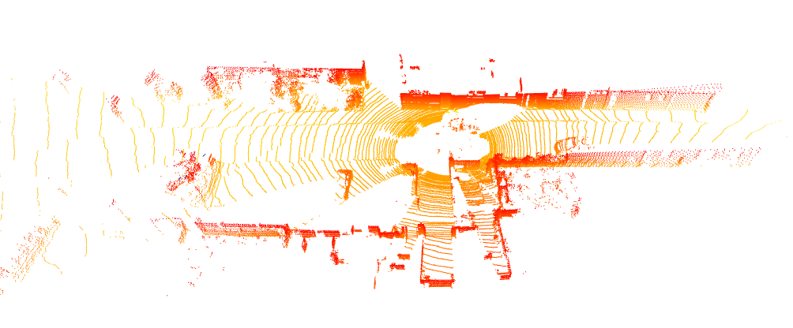

# pcdviz
pcdviz is a tool help to visuliaza pointcloud, labels and user-defined shapes. In addition, it also provides tool functions to generate charts and animations, etc. It's inspired by open3d.

## Install
```
pip3 install pcdviz
```

## Quick start
You can use it in many scenarios, here are some examples.

#### Display point cloud
If you only need to display the point cloud, specify the point cloud path and run the following command.
```
pcdviz --pcd=data/kitti/velodyne/training/000003.bin --example
```

> --example means example mode, you can remove it in normal mode



#### Display multi point cloud
If you want to display multiple point clouds at the same time, such as the results of ground detection, or the results of point cloud registration.

From here on we start to use the configuration file method because it is more flexible.
```
pcdviz --cfg=config/multi_pointcloud.yaml --example
```

> --example means example mode, you can remove it in normal mode


#### Display point cloud and labels
In the field of deep learning, we want to visualize detection results and compare them with ground truth.
```
pcdviz --cfg=config/frame_visualize.yaml --example
```

> --example means example mode, you can remove it in normal mode


#### Display dataset
If you want to view the whole dataset like KITTI, Nuscenes, Waymo. The first frame is initially displayed, and you can switch to the next frame by pressing the button `N`.
```
pcdviz --cfg=config/dataset_visualize.yaml --example
```

> --example means example mode, you can remove it in normal mode


## Plan
dataset
- Customize the frame order, which is useful when checking data quality
- Automatically filter based on conditions, for example, only display frames where the number of pedestrians is greater than 3

statistics
- Generate statistical charts for datasets
